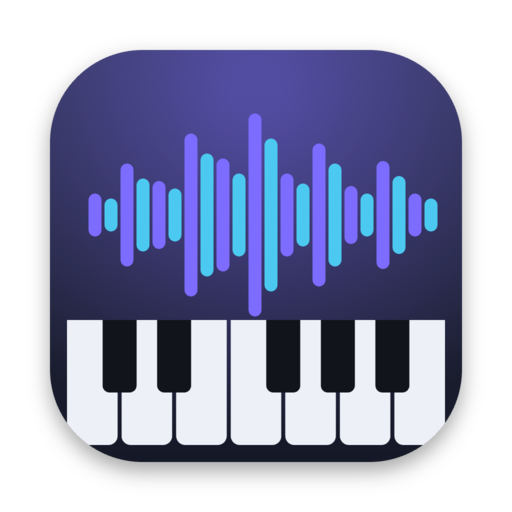

# fabu

**The simplest music creation program out there.** Free, open-source, and you
can jam live with friends. Built with Electron + the Web Audio API.

→ **Download:** https://rquw.github.io/fabu/



## Features

- A clean timeline workspace — your song is the background, everything else is a small window.
- Piano-roll MIDI editor, synth instruments + a drum kit, and your own **sampler instruments** from any audio file.
- Per-clip effects: gain, real pitch-shift, speed, drive, bitcrush, low-pass filter, fades.
- 3-band EQ mixer, pan, mute/solo, and **automation** keyframes.
- Record the mic or record notes live from your keyboard (exact timing, count-in).
- **Live multiplayer** — make music in the same project together, with cursors, a player list, host controls and locks.
- Save/load `.fab` projects and export **WAV / MP3 / OGG**.
- English & German, light nudges, undo on everything.

## Run from source

```bash
npm install
npm start
```

## Build installers

```bash
npm run dist        # current OS
npm run dist:mac    # macOS universal .dmg (Apple Silicon + Intel)
npm run dist:win    # Windows .exe installer
```

Releases are built automatically by GitHub Actions on a version tag and
published to the [Releases page](https://github.com/rquw/fabu/releases). The app
auto-updates itself from there.

## The relay server

Live multiplayer uses a tiny WebSocket relay (see [`relay/`](relay/)). Deploy it
on any free Node host (Render works well).

## License

[MIT](LICENSE) © Fabio Schwaiger. Made with the help of Claude.
